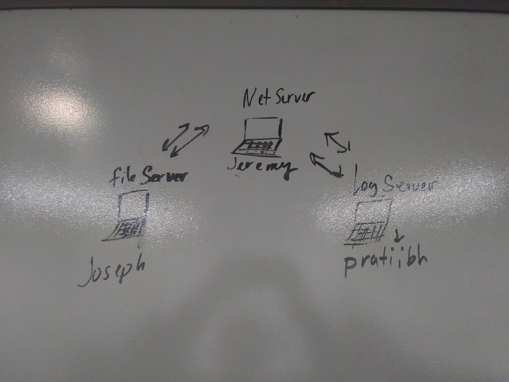

# LAB - 17

## TCP Server / Message Application

### Author: Joseph Hangarter, Pratiibh Bassi, Jeremy Lee

### Links and Resources
* [submission PR](http://xyz.com)
* [travis](http://xyz.com)

### Modules
#### `app.js`
#### `server.js`
#### `logger.js`
#### `app-test.js`
#### `test.txt`

##### Exported Values and Methods

###### `fs.read(file) -> string`
uppercase

###### `fs.write(write) -> string`
saved

### Setup
#### `.env` requirements
* `PORT` - 3001

#### Running the app
* `node app.js 'files/test.txt'` - to run read/write fs
  
#### UML

